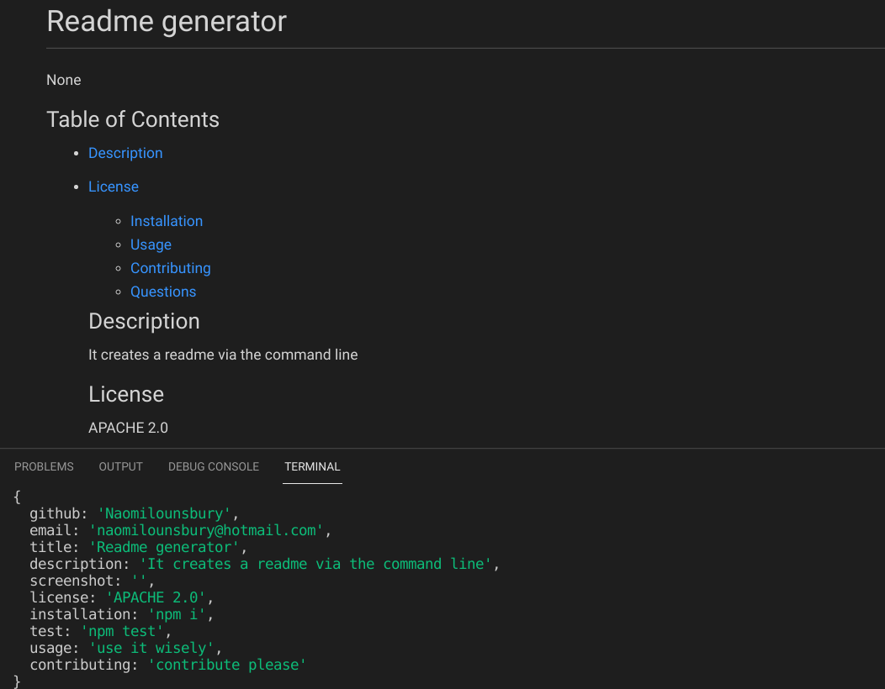

# Readme Generator
  
  

  ## Table of Contents
  * [Description](#description)
  * [License](#license)

  * [Installation](#installation)
  * [Usage](#usage)
  * [Contributing](#contributing)
  * [Questions](#questions)
  ## Description
  This project generates readmes from the command line. 
  
  ## License
  APACHE 2.0
  This is licensed under APACHE 2.0
  ## Installation
  npm i
  ## Usage 
  Its all about readmes. Use at your own risk
  ## Contributing
  please contribute. I don't know what I'm doing.
  ## Questions
  Github: [Naomilounsbury](https://github.com/Naomilounsbury)
  Email: naomilounsbury
  